<p align="center">
  
</p>

# LunarCoin

### Educational Local-First Blockchain Ecosystem

> A fully-featured, simulated, local-first blockchain ecosystem designed to teach decentralized systems architecture, proof-of-work consensus, elliptic curve cryptography, stack-based smart contracts, and DAO governance in a sandboxed desktop environment.

<p align="center">
  
  
  
  
  
</p>

---

## 1. What is LunarCoin?

LunarCoin is a local-first blockchain client and simulation sandbox designed for educational transparency. Rather than interacting with black-box cloud systems or paying volatile gas fees, developers, students, and blockchain architects can run a complete, multi-threaded node directly on their local machine.

### Key Philosophies

*   **Local-First & Offline Resilience**: Operating entirely within the user's workspace using a Python Flask core and an Electron-React wrapper. Ledger databases (`chain.json`) are stored natively in `~/LunarCoinData/`.
*   **Decentralized Learning Playground**: Designed to teach the full ledger lifecycle. All subsystems—from cryptographic key derivation to transaction sign/verify, P2P network gossip, block mining, stack VM execution, and governance voting—are exposed through high-fidelity visual interfaces.
*   **Fully Deterministic Simulation**: Features standard CPU hashing loops, actual SECP256R1 signatures, a stack-based smart contract runtime, and peer-to-peer network routing simulation that behaves exactly like production-grade public protocols.

---

## 2. Core Features

LunarCoin organizes its features into modular, technical components:

| Feature | Purpose | Inputs | Outputs | Blockchain Interactions |
| :--- | :--- | :--- | :--- | :--- |
| **Dashboard** | Monitors system health and network synchronization. | Connected peer telemetry, local block tip height. | System metrics (TPS, Block tip, Peer counts). | Read-only ledger queries to track tip state. |
| **Mining Control** | Executes CPU-based mining work loops. | Nonce search range, candidate block template. | Solved candidate block, block reward. | Appends verified blocks to the local chain ledger. |
| **Blocks Explorer** | Chronological blockchain examiner. | Path to ledger database file. | Detailed table listing height, difficulty, nonce, hash. | Scans entire block history sequentially. |
| **Analytics Dashboard** | Computes transaction and mining metrics. | Historical block times, gas fees. | Workload delta charts, hashrate history graph. | Computes rolling averages of block generation rates. |
| **Transactions Ledger** | Tracks completed value transfers. | Path to transaction ledger database. | Transaction list (amounts, fees, timestamps). | Queries state changes within historical block heights. |
| **Wallet Manager** | Manages local identities and funds. | SECP256R1 keypair file. | Public address, spendable balance, mined rewards. | Resolves UTXOs and transaction balances. |
| **Send Coins** | P2P value transfer compiler. | Recipient address, token amount, transaction fee. | Broadcastable signed transaction payload. | Pulls UTXOs, signs inputs, publishes to mempool. |
| **Smart Contracts** | LunarVM stack bytecode workbench. | JSON array program assembler, call gas. | Stack traces, storage map updates, outputs. | Appends contract code to block, updates storage. |
| **DAO Governance** | Staking-weighted parameters control. | Locked staker deposit, vote selection. | Staked balance receipt, voting weight boost. | Locks balances, applies voting modifiers. |
| **AI Agents Hub** | Sandboxed threat auditing and monitoring. | Ledger metrics, difficulty sliders. | Risk assessment logs, tokenomic forecast charts. | Scans blocks for structural anomalies. |
| **LunarFS Manager** | Content-addressed storage tracker. | Local file upload path. | Unique content hash identifier, replication nodes. | Logs content hash ownership to contract state. |
| **NFT Registry** | Media collector registry system. | Metadata path, LunarFS hash, owner address. | Minted collectible card metadata. | Compiles contract variable mappings on LunarVM. |
| **DApps Workbench** | Precompiled starter pack compiler. | Selected template, constructor inputs. | Instance address, deployed program logs. | Deploys contract templates to the network. |
| **System Settings** | Configures network endpoints and miner bounds. | Flask URL, thread count, difficulty mask. | Updated configuration file. | Adjusts the active difficulty verification mask. |
| **P2P Network** | Live topology controller. | Remote peer socket address. | Topography map, latency relays, sync status. | Propagates consensus blocks, syncs chain tips. |
| **Node Reputation** | Evaluates compliance across connected nodes. | Peer block solutions, latency audits. | Active trust metrics table, infraction logs. | Bans malicious IP addresses from block propagation. |

---

## 3. Complete System Architecture

LunarCoin's internal layers are split between a presentation/desktop layer (Electron + React) and a local-first blockchain engine (Python Flask). Communication happens over low-latency REST endpoints and P2P sockets.

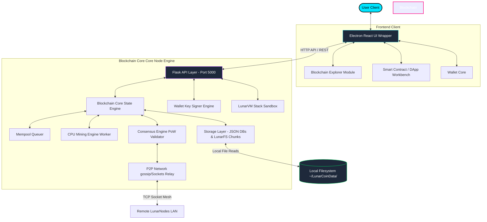

---

## 4. Blockchain Lifecycle

The execution lifecycle of transactions, block validation, state updates, and visualization conforms to standard decentralization logic:

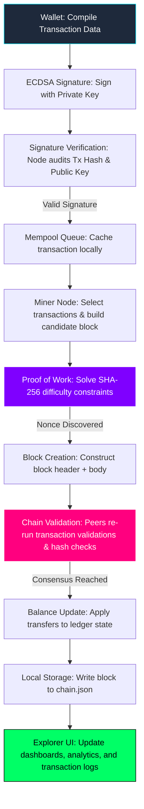

---

## 5. Mining Architecture

Mining in LunarCoin is powered by a multi-threaded CPU engine enforcing a strict Proof of Work consensus rule.

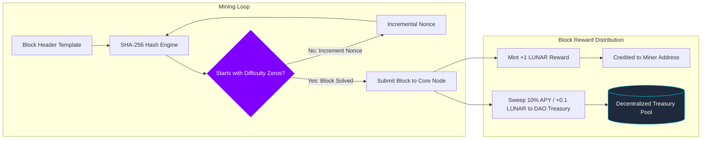

### Mining Specifications
*   **Hashing Core**: `SHA-256` operates on the block header fields: `index + previous_hash + timestamp + transactions_root + nonce`.
*   **Difficulty Adjustment**: Enforced via a prefix mask (e.g., Difficulty Mask `4` requires hex hashes to start with four zeros: `0000...`).
*   **Treasury Split**: For every block solved, `1.0 LUNAR` is minted. `0.9 LUNAR` is awarded to the miner's address, and `0.1 LUNAR` (10%) is automatically swept into the DAO treasury smart contract to fund network governance and staking APY yield projections.

---

## 6. Wallet Architecture

LunarCoin Wallets manage account balances and security through asymmetric elliptic curve cryptography.

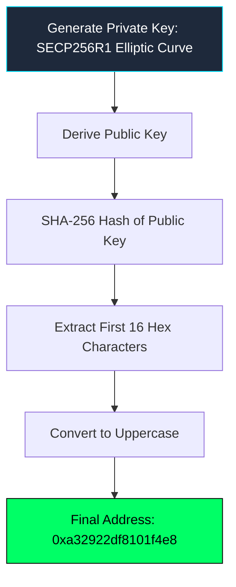

### Key Derivation Rules
*   **Elliptic Curve Standard**: The node uses standard `secp256r1` parameters to sign and verify transactions.
*   **Cryptographic Address Derivation**:
    $$\text{Address} = \text{HexSubstring}(\text{SHA-256}(\text{Public Key}), 0, 16)\text{.toUpperCase()}$$
    This yields a clean, readable 16-character hexadecimal address identifier.

---

## 7. Transaction Lifecycle

Below is the sequential communication map of an asset transfer:

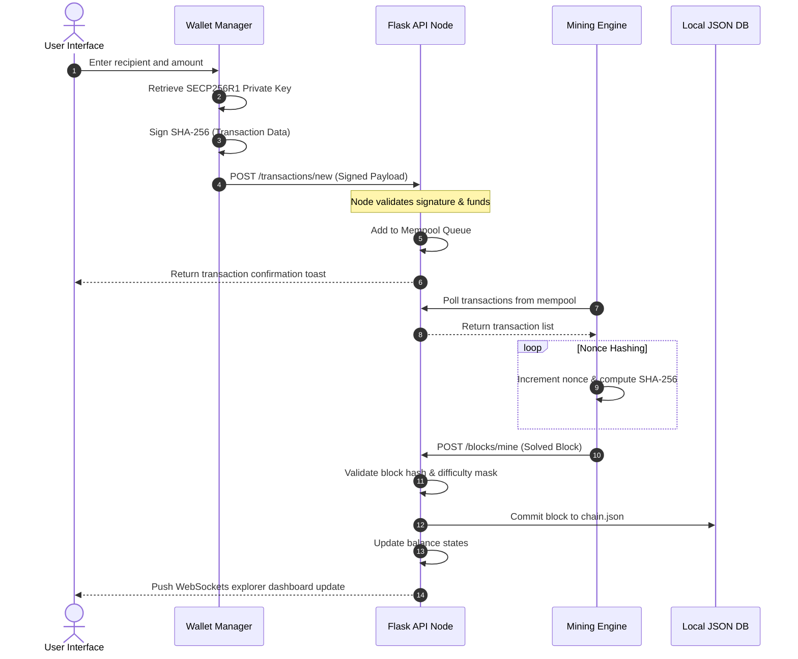

---

## 8. Peer-to-Peer (P2P) Network

Nodes discover each other locally using a decentralized socket topology, ensuring that ledgers remain in sync without central oversight.

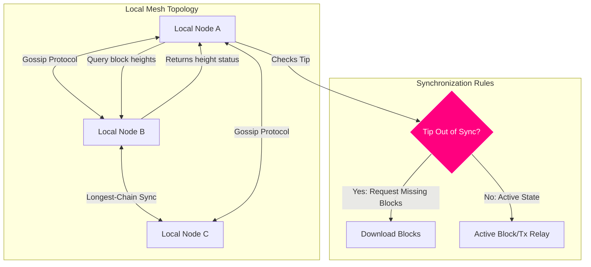

*   **Peer Discovery**: Nodes bootstrap by connecting to a designated local bootstrap server URL (default `127.0.0.1:5002`) and registering their socket connection strings.
*   **Gossip Protocol**: Newly generated transactions and mined blocks are broadcast to all connected peer socket relays instantly.
*   **The Longest Chain Rule**: If two competing blocks are mined at the same height, nodes track both forks. The node will automatically switch its active validation path to the fork containing the highest cumulative proof-of-work difficulty.

---

## 9. Smart Contracts (LunarVM)

LunarCoin includes **LunarVM**, a custom stack-based execution sandbox running deterministic instruction bytecodes.

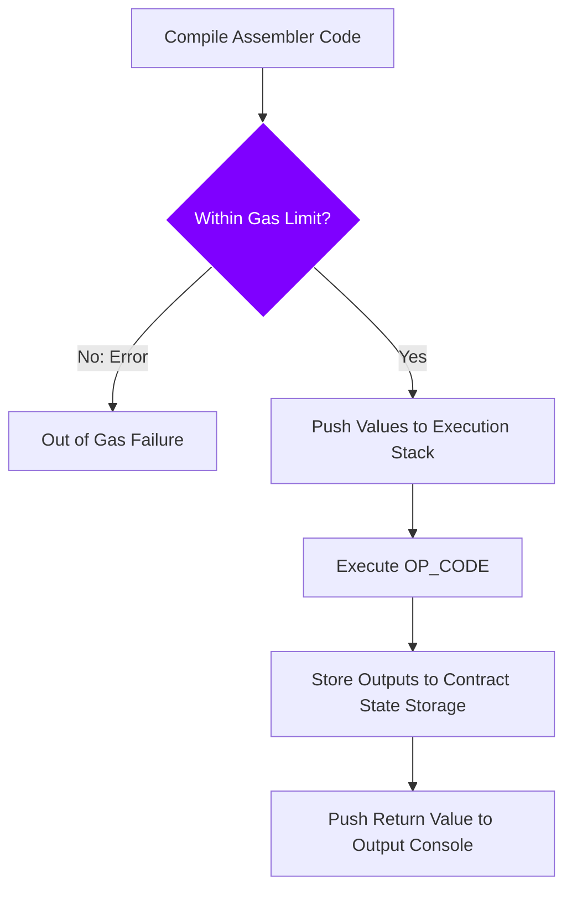

*   **Assembly Syntax Example**:
    ```json
    [
      ["PUSH", 21],
      ["PUSH", 2],
      ["MUL"],
      ["STORE", "answer"],
      ["LOAD", "answer"],
      ["RETURN"]
    ]
    ```
*   **State Persistence**: Execution storage is decoupled from the node's local files. Contracts read and write strictly to their unique sandboxed storage mapping tables, committed directly onto the chain.

---

## 10. DAO Governance

Ecosystem parameter changes (such as staking rates and reward splits) are controlled democratically via the Decentralized Autonomous Organization (DAO) portal.

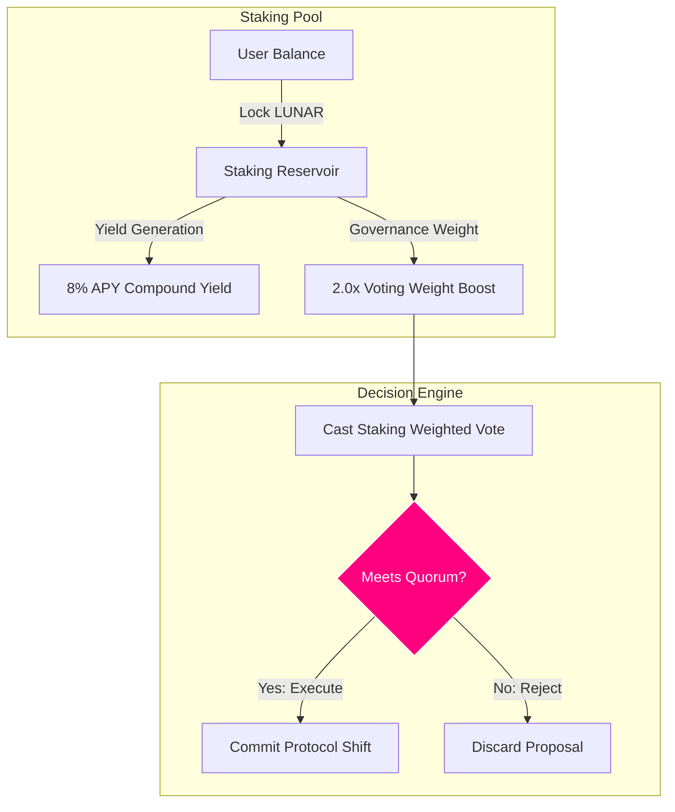

*   **Treasury Mechanics**: Block reward sweeps dynamically accrue inside the DAO treasury pool. These assets cannot be transferred unless authorized by a quorum proposal.
*   **Staking Weights**: Users lock LUNAR tokens to earn an 8% APY yield projection while gaining a `2.0x` voting power multiplier.

---

## 11. AI Agents Hub

A sandbox monitor controls autonomous agents acting as compliance sentinels, tokenomic predictors, and smart contract auditors.

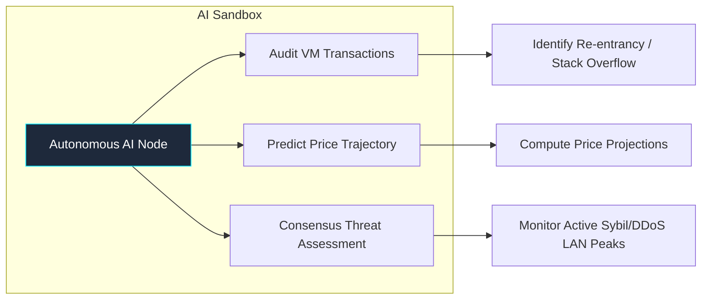

*   **Auditing Sentinels**: Scans blocks for signature verification speeds and transaction volume spikes to flag anomalous client behavior.
*   **Tokenomic Projections**: Simulates price vectors using random-walk simulations influenced by active mining difficulty masks and node counts.

---

## 12. LunarFS Storage & NFT Framework

LunarFS is a decentralized, local-first content-addressed storage engine designed to manage NFT media data.

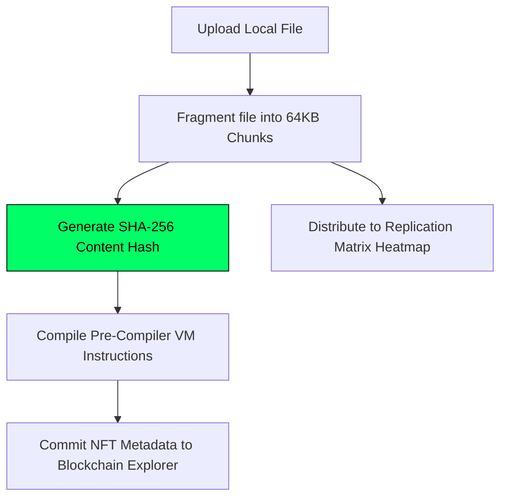

*   **Fragmentation**: Large files are split into deterministic `64KB` chunk segments.
*   **Replication Heatmap**: Monitors replica counts across LAN peers to ensure chunks remain available (Highly Seeded, Healthy, or Single Node).
*   **NFT Registration**: Media identifiers are tied directly to LunarVM contract states (`nft_owner`, `nft_media_hash`), preventing digital asset duplication.

---

## 13. Folder Architecture

The codebase layout isolates visual execution modules from backend blockchain validation engines:

```text
lunar-coin-blockchain-explorer/
├── electron/                  # Electron main/preload process managers
│   └── main.js                # Desktop window and native process bindings
├── app/                       # React frontend source files
│   ├── components/            # UI modules (Mining Room, Wallet, DAO, LunarFS, etc.)
│   ├── lib/                   # Utility layers, LunarVM client, and ECDSA key helpers
│   ├── hooks/                 # React states hooks for blocks, peers, and mempool APIs
│   ├── styles/                # Vanilla CSS styling files (Glassmorphism layout)
│   └── index.html             # Application entry markup file
├── backend/                   # Python Flask blockchain simulation engine
│   ├── core/                  # Blockchain ledger, Block, and Tx structures
│   ├── consensus/             # CPU mining routines and block reward rules
│   ├── vm/                    # LunarVM bytecode parser and executor
│   ├── p2p/                   # Socket-based P2P networking protocols
│   └── storage/               # Native file storage modules (~/LunarCoinData/)
├── screen_shots/              # UI walkthrough asset images
├── package.json               # Frontend dependencies and packaging scripts
├── requirements.txt           # Python backend dependencies
└── README.md                  # System documentation and handbook
```

---

## 14. Tech Stack

LunarCoin is built using highly-responsive, low-overhead tools:

| Category | Technology | Usage |
| :--- | :--- | :--- |
| **Frontend** | React / JavaScript | High-fidelity interactive dashboards and real-time state visualization. |
| **Styling** | Vanilla CSS | Custom cyberpunk gradients, glowing buttons, and responsive glassmorphic cards. |
| **Desktop Wrapper** | Electron | Connects frontend React components to native system APIs and Python processes. |
| **Backend Core** | Python Flask | Lightweight REST API server processing blockchain state transactions. |
| **Cryptography** | ECDSA (secp256r1) / SHA-256 | Signature validation, block puzzle hashing, and address derivation. |
| **Storage** | Local JSON Database | Flat-file JSON databases (`chain.json` / `wallet.json`) for data persistence. |
| **Storage (FS)** | LunarFS | Fragmented content-addressed storage for decentralized media files. |
| **P2P Networking** | WebSockets / TCP Sockets | Real-time transaction gossip and block propagation across local networks. |

---

## 15. Security Model

LunarCoin maintains a strict blockchain security model, protecting the ledger from manipulation:

*   **Non-Custodial Key Security**: Private keys are generated locally via secp256r1 curves. They are written to `~/LunarCoinData/wallet.json` and are never broadcast over HTTP APIs.
*   **Digital Signatures**: Every ledger state transfer must include a valid ECDSA signature. The backend validates `SHA-256(TxData)` against the sender's public key before queuing the transaction.
*   **Ledger Verification**: On node startup, the backend sweeps the local database. It recalculates the hash chain sequentially from genesis to verify that block hashes and transaction merkle roots remain unmanipulated.

---

## 16. Platform Walkthrough

Explore a typical user session with the LunarCoin client, from launching the miner to deploying contracts and auditing peer networks:

### Step 1: Client Startup & Miner Idle HUD
The desktop miner launches. The **Mining Control Room** loads in an idle state. No CPU threads are active, the balance shows `17.5 LUN`, and hashes/sec reads zero.
<p align="center">
  
</p>

### Step 2: Hashing Engine Activated
Clicking **Start Engine** launches the mining loops. CPU threads immediately start scanning nonce spaces. The hash speed climbs to `58,190.39 H/s`, and the node quickly finds block #355, raising the wallet balance to `18.4 LUN`.
<p align="center">
  
</p>

### Step 3: Hashing Diagnostics & Sockets Status
Scrolling down the mining control board displays the live nonce (`9,363,025`) alongside the exact candidate hex hash. The network log tracks local websocket bindings and active console outputs.
<p align="center">
  
</p>

### Step 4: Live Mining Analytics Charts
Switching to the **Work Diagnostics** tab reveals realtime performance charts. The graphs plot hashrate trends and workload delta. A green notification slides in to announce `+1 LUNAR BLOCK FOUND!`.
<p align="center">
  
</p>

### Step 5: Chain Block Browser
Navigating to the **Blocks** tab displays the network ledger database. The table catalogs block heights, execution hashes, difficulty masks, timestamps, and block rewards.
<p align="center">
  
</p>

### Step 6: Fee Analytics & Gas Estimator
The **Fee Analytics** view displays the gas cost curves of transactions across different priority queues. High-priority transfers can be structured to bypass the standard mempool queue.
<p align="center">
  
</p>

### Step 7: Completed Transactions Ledger
The **Transactions** screen lists confirmed transactions. Clicking a tx hash displays input metrics, target recipient addresses, fee metrics, and execution status.
<p align="center">
  
</p>

### Step 8: Cryptographic Wallet Dashboard
The **Wallet** page displays the node's local account data. The private keys stored in `wallet.json` resolve to the public address `0xa32922df8101f4e8`. The wallet balance is updated to `40.9 LUN`.
<p align="center">
  
</p>

### Step 9: Compiling Value Transactions
Selecting the **Send Coins** tab opens the transfer utility. The interface enables the user to specify a recipient address, transfer amount, and transaction fee before signing the transaction payload.
<p align="center">
  
</p>

### Step 10: Smart Contract Deployment Form
The **Smart Contracts Workbench** displays assembly bytecode designed to multiply two numbers. Clicking **Compile & Deploy** queues the contract deployment transaction in the mempool.
<p align="center">
  
</p>

### Step 11: Contract Execution Console
Under **Execution Console**, the compiled contract is invoked. The virtual machine executes the multiplication bytecode in 0.028 ms, storing the result (`42`) and outputting a JSON execution log.
<p align="center">
  
</p>

### Step 12: DAO Governance Dashboard
The **Governance** dashboard manages proposal voting and reward distributions. Locking LUN tokens yields 8% APY and scales voting weight by 2.0x.
<p align="center">
  
</p>

### Step 13: Spawning AI Sandbox Nodes
The **AI Agents Hub** displays active agents auditing transactions and predicting tokenomics. A tokenomics simulator runs pricing models based on difficulty targets and node counts.
<p align="center">
  
</p>

### Step 14: Content-Addressable Storage
Under **LunarFS**, the user uploads a screenshot. The file is fragmented into 64KB chunks. The right panel displays the compiler code generated to register the file as an NFT.
<p align="center">
  
</p>

### Step 15: NFT Media Gallery Catalog
Scrolling down the LunarFS tab reveals the **Ecosystem Media Collectibles (NFT Gallery)**. The uploaded file is registered as a "Lunar Cyberpunk Badge" developer token owned by the user.
<p align="center">
  
</p>

### Step 16: Block Mined Success Alert
A success modal confirms `Block Successfully Mined!`. The transaction has been sealed onto the blockchain, committing the state transitions to the ledger.
<p align="center">
  
</p>

### Step 17: Precompiled DApps Catalog
The **DApps** screen lists precompiled smart contract templates. The catalog includes templates for ERC-20 utility tokens, escrow contracts, and decentralized voting tools.
<p align="center">
  
</p>

### Step 18: System Node Config Settings
The **Settings** dashboard enables node configuration. Users can set difficulty limits, allocate CPU mining threads, and view directory paths for local databases.
<p align="center">
  
</p>

### Step 19: P2P LAN Topography Map
The **P2P Network** dashboard displays local network topology. The screen includes peer synchronization lists and tools to link remote LAN node endpoints.
<p align="center">
  
</p>

### Step 20: Node Compliance Ledger
The **Node Reputation** system displays peer trust indexes. The ledger audits connected nodes, logging infractions and updating trust scores (+5 for valid blocks, -25 for bad recalculations).
<p align="center">
  
</p>

---

## 17. Roadmap

The future development goals for the LunarCoin simulation network are outlined below:

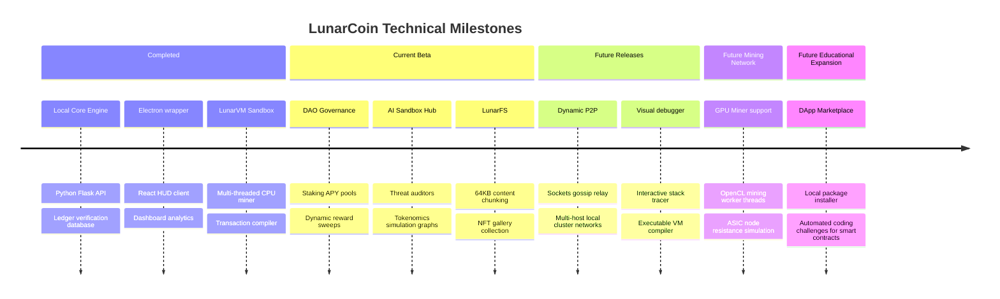

---

## 18. Contribution Guide

We welcome contributions to the LunarCoin educational ecosystem. Follow these steps to set up the project locally:

1.  **Fork and Clone**:
    ```bash
    git clone https://github.com/your-username/lunar-coin-blockchain-explorer.git
    cd lunar-coin-blockchain-explorer
    ```
2.  **Initialize the Backend Core**:
    ```bash
    python3 -m venv venv
    source venv/bin/activate
    pip install -r requirements.txt
    python backend/main.py   # Runs API server on http://127.0.0.1:5000
    ```
3.  **Initialize the Desktop Frontend client**:
    ```bash
    npm install
    npm run dev             # Launches the Electron sandbox workspace
    ```
4.  **Create a Branch & Submit PR**:
    *   Create a branch for your feature (`git checkout -b feature/amazing-feature`).
    *   Commit changes and submit a PR to the main branch for review.

---

## 19. License

Distributed under the MIT License. See [LICENSE](LICENSE) for details.
