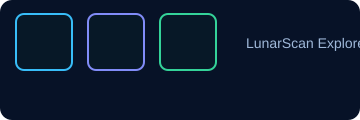
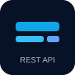
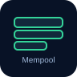
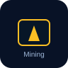
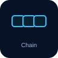
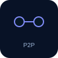
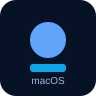

<p align="center">
  
</p>

# LunarCoin — Decentralized Educational Blockchain

**v0.1.0-beta** — Educational Blockchain Platform

A local-first educational blockchain ecosystem: mine blocks, sign transactions, deploy smart contracts, run AI agents — all on your machine.

---

## Quick Links

- [Download Release](https://github.com/Zayannnnn/LunarCoin/releases/tag/v0.1.0-beta)
- [Explore System Architecture](#architecture)

---

## Stats

| Core Modules | Proof | Crypto | Local |
|---|---:|---:|---:|
| 13+ | SHA-256 | secp256k1 | 100% Local-First |

---

## Architecture

Every component is orchestrated through a local API node. The Electron client talks to the blockchain engine, wallet, mempool, miner, P2P layer, smart contracts, governance, AI agents, and LunarFS — all running locally.



---

## Screenshots — Project In Action

The following screenshots are taken from the `screen_shots/` folder and demonstrate the running application (dashboard, mining, wallet, mempool, and explorer views).

<p align="center">
  
</p>

<p align="center">
  
  
</p>

<p align="center">
  
  
</p>

<p align="center">
  
</p>

---

## Transaction Lifecycle (illustrated)

| Step | Description |
|---|---|
|  | Client UI |
|  | REST API |
|  | Wallet Sign |
|  | ECDSA Verify |
|  | Mempool Queue |
|  | SHA-256 Mining |
|  | Chain Append |
|  | P2P Broadcast |
|  | Peer Sync |

---

## Core API Endpoints

```
GET  /api/chain              # Returns full blockchain
POST /api/mine               # Trigger mining
POST /api/transactions/new   # Submit signed transaction
GET  /api/mempool            # List pending transactions
POST /api/wallet/create      # Create new wallet (ECDSA)
GET  /api/nodes/register     # Register peer node
POST /api/contracts/deploy   # Deploy smart contract to LunarVM
WS   /ws/chain-events        # Live chain events (WS)
POST /api/governance/propose # Create DAO proposal
POST /api/lunarfs/store      # Store file (LunarFS)
POST /api/nft/mint           # Mint NFT
GET  /api/nodes/resolve      # Resolve forks / consensus
```

---

## Platform Modules (high level)

-  **Mining Engine** — Real SHA-256 PoW, dynamic difficulty, block rewards.
-  **Wallet Engine** — ECDSA secp256k1 keypairs, local private keys.
-  **Blockchain Core** — Genesis, validation, hash linking, persistent LevelDB storage.
-  **P2P Network** — WebSocket peer-to-peer sync and discovery.
-  **Mempool** — Fee-prioritized transaction queue.
-  **Smart Contracts (LunarVM)** — Deterministic contract execution persisted on-chain.
-  **DAO Governance** — On-chain proposals, voting, treasury.
-  **AI Agents** — Autonomous on-chain monitoring and actions.
-  **LunarFS** — Content-addressed distributed storage.
-  **NFTs** — Minting and ownership recorded on-chain.
-  **DApps** — Developer API access to wallet, LunarVM, LunarFS.
-  **LunarScan** — Live blockchain explorer embedded in the client.

---

## Module Status

| Module | Technology | Description | Status |
|---|---|---|---|
| Mining Engine | SHA-256 | Proof-of-Work with dynamic difficulty and block rewards | Live |
| Wallet System | secp256k1 | ECDSA key pairs and local storage | Live |
| Blockchain Core | LevelDB | Block validation, hash linking, persistent chain | Live |
| P2P Network | WebSocket | Peer discovery, block sync, consensus | Live |
| Mempool | Python | Fee-prioritized pending transactions | Live |
| Smart Contracts | LunarVM | Deploy & execute contracts, persist state | Live |
| DAO Governance | On-Chain | Proposals, voting, treasury | Live |
| AI Agents | Python/API | On-chain monitoring & automation | Live |
| LunarFS | Content Hash | Content-addressed distributed file storage | Live |
| NFTs | On-Chain | Mint, transfer, verify ownership | Live |
| DApps | API Layer | Decentralized application infra | Live |
| LunarScan Explorer | Electron | Local explorer with fallback node | Live |

---

## Roadmap (short)

- Phase 1–6: Core systems, desktop miner, P2P, governance, agents, LunarFS — shipped.
- Phase 7: Public Beta — in progress.
- Phase 8: Mainnet research — upcoming.

---

## Installation

- Windows: see release `LunarCoinMiner-Setup.exe` 
- macOS: see release `LunarCoinMiner-mac.zip` 

Download the latest release: https://github.com/Zayannnnn/LunarCoin/releases/tag/v0.1.0-beta

---

## License & Credits

Built for learning, designed for exploration. See the repository for full credits and license.
