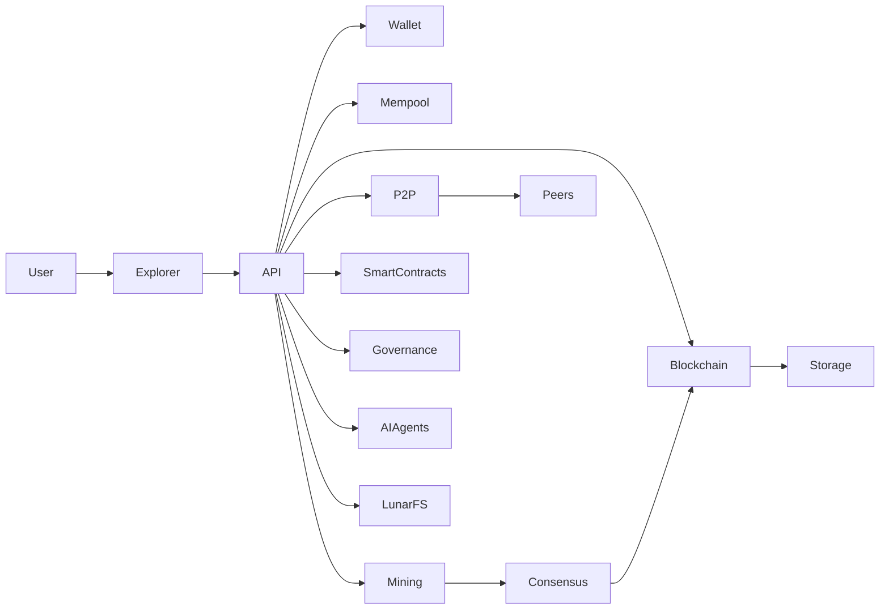
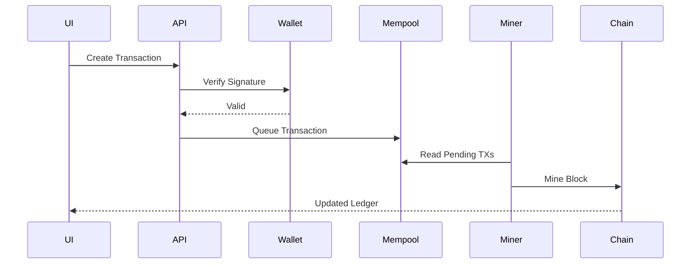
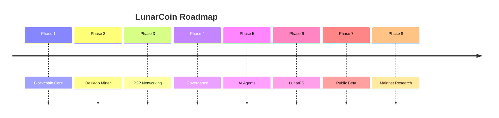

#  LunarCoin

## Demystifying Blockchain Through Real-Time CPU Mining

A local-first educational blockchain ecosystem featuring Proof-of-Work mining, wallets, transactions, P2P networking, smart contracts, DAO governance, AI agents, LunarFS distributed storage, NFTs, DApps, and a modern explorer..

---

## System Architecture

## Request Flow

---

## Platform Modules

### Dashboard
Real-time blockchain telemetry, chain health, mining statistics, balances, rewards, network state and explorer metrics.

### Mining Engine
- SHA-256 Proof of Work
- Dynamic Difficulty
- Block Rewards
- Treasury Allocation
- Nonce Discovery

### Blockchain Core
- Genesis Block
- Chain Validation
- Longest Chain Consensus
- Block Integrity Verification
- Hash Linking

### Wallet System
- ECDSA secp256k1
- Address Generation
- Digital Signatures
- Balance Tracking
- Local Key Ownership

### Transaction Layer
- Signature Validation
- Mempool Queue
- Confirmation Lifecycle
- Ledger Settlement

### P2P Network
- Peer Discovery
- Node Registration
- Block Synchronization
- Fork Resolution
- Consensus Alignment

### Smart Contracts
LunarVM execution environment for educational contract deployment and execution.

### Governance
Proposal creation, treasury voting and decentralized decision making.

### AI Agents
Autonomous blockchain agents capable of monitoring and interacting with on-chain systems.

### LunarFS
Distributed content-addressed storage layer.

### NFTs
Digital asset ownership and metadata management.

### DApps
Decentralized applications built on top of LunarCoin infrastructure.

---

## Screenshot Gallery

Use your uploaded screenshots under:

- Dashboard
- Mining
- Blocks
- Analytics
- Transactions
- Wallet
- Smart Contracts
- Governance
- AI Agents
- LunarFS
- NFTs
- DApps
- P2P Network

---

## Local-First Design

Keys, mining, blockchain validation and wallet ownership remain on the user's machine.

Cloud infrastructure is used only for explorer fallback and public chain visibility.

---

## Roadmap

---

## Installation

### Windows
Download: LunarCoinMiner-Setup.exe

### macOS
Download: LunarCoinMiner-mac.zip

Release:
https://github.com/Zayannnnn/LunarCoin/releases/tag/v0.1.0-beta

---

## Vision

LunarCoin provides a practical environment for learning cryptography, consensus, mining, networking and decentralized systems through direct interaction rather than simulation.
